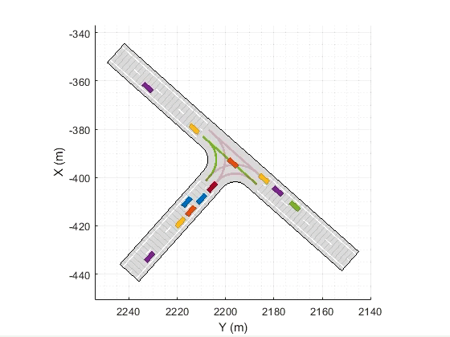

# OpenTrafficLab

OpenTrafficLab is a MATLAB&reg; environment capable of simulating simple traffic scenarios with vehicles and junction controllers. The simulator provides models for human drivers and traffic lights, but is designed so that users can specify their own control logic both for vehicles and traffic signals. The purpose of the simulator is test multi-agent autonomous vehicle control algorithms and intelligent traffic control algorithms.

The simulator makes use of tools in the Automoted Driving ToolboxTM, namely, the DrivingScenarioDesigner app and the drivingScenario object it generates. These tools can be used efficiently to represent road networks, populate them with vehicles and specify their trajectories. However,  the motion of the vehicles is meant to be specified before the simulation is ran by specifying waypoints to the vehicles' trajectories manually. OpenTrafficLab is meant to extend this functionality by simulating traffic in closed loop simulation, where the vehicles' speed trajectories are not given apriori but are the product of a state dependent control logic.

**Driving Scenario Designer Application** is part of Automated Driving Toolbox. Refer to the documentation [here](https://www.mathworks.com/help/driving/ref/drivingscenariodesigner-app.html) for more information.

## MATLAB&reg; Toolbox Dependencies
This model has been tested with MATLAB R2020b. The version tested with MATLAB R2020a is being developed.

To run this model, you need: MATLAB, Automated Driving ToolboxTM.

## Getting Started
To get started, users can go through [OpenTrafficLabIntroductoryExample.mlx]() for a documented example covering scenario creation, junction controller creation, vehicle generation, and running a simulation using the provided car following models.

## Architecture
OpenTrafficLab is built using an Object Oriented Programming (OOP) architecture. Concepts of OOP, and OOP in MATLAB can be reviewed [here](https://www.mathworks.com/discovery/object-oriented-programming.html). The structure of the simulator makes use existing classes of the Driving Scenario Designer App, like drivingScenario, Vehicle, and Actor. Crucially, three classes that need to be understood are added:

* A [Node]() class that is used for three main purposes:
    1. To represent the network as a directed graph of connected lanes and turns that vehicles can use to specify their routes through the network.
    2. To provide a mapping between global position, the station distance along the length of the lane, and the direction and curvature of the lane
    3. To connect vehicles and traffic controllers.
* A [DrivingStrategy]() class that controls the vehicles in the network.
    1. The DrivingStrategy object implements car following longitudinal control, and tracks the center lane statically, that is, it assumes no dynamics for lane keeping.
    2. Two car following models, the Gipps Car Following Model and the Intelligent Driver Model, are pre-programmed into the DrivingStrategy class and they can be used to benchmark againts a human driven scenario. These models guarantee safe front to back driving, but rely on proper junction controllers to avoid lateral collisions.
    3. To implement user defined driving logic, DrivingStrategy can be used as a parent class and the relevant methods can be overriden.
* A [TrafficController]() class that is used to model and implement traffic rules and signalization.
    1. A TrafficController object is associated with all Nodes (i.e. lanes or turns) it is meant to control. It controls them by setting the Node as open or closed. A vehicle should react to an upcoming closed Node by not entering it.
    2. To implement user defined traffic control logic, TrafficController can be used as a parent class and the relevant methods can be overriden. The repository includes one such controller, in a [TrafficLight]() class that inherits from TrafficController

## Simulating Traffic

To set up a simulation users must create a road network and specify the driving direction and connectivity of lanes and turns. The drivingScenario object containing the road network can be created using the DrivingScenarioDesigner or its programatic API. Functions to create two sample scenarios are included in the repository, one for a T-Junction ([createTJunctionScenario.m]()) and one for a four-way junction ([createFourWayJunctionScenario.m]()). The network of Node objects is then built by associating each lane or turn in the road network to a Node, and linking the Nodes together accordingly. Functions for creating the Nodes and their connectivity for the the two examples are also provided (see [createTJunctionNetwork.m]() and [createFourWayJunctionNetwork.m]()).

Next vehicles and their entry times must be generated, along with the DrivingStrategy objects that will control them. Entry times can be generated using the provided Poisson arrival process model, which is implemented in the [generatePoissonEntryTimes.m]() function, within the drivingBehavior [package](https://www.mathworks.com/help/matlab/matlab_oop/scoping-classes-with-packages.html). Functions that create vehicle and drivers for the two nominal examples are provided (see [createVehiclesForTJunction.m]() and [createVehiclesForFourWayJunction.m]()).

A traffic controller, such as a traffic light, can be created to dynamically control when Nodes (i.e. lanes or turns) can be entered by vehicles.

Finally, the simulation can be executed by calling the [advance](https://www.mathworks.com/help/driving/ref/drivingscenario.advance.html?s_tid=srchtitle) function on the drivingScenario object.

